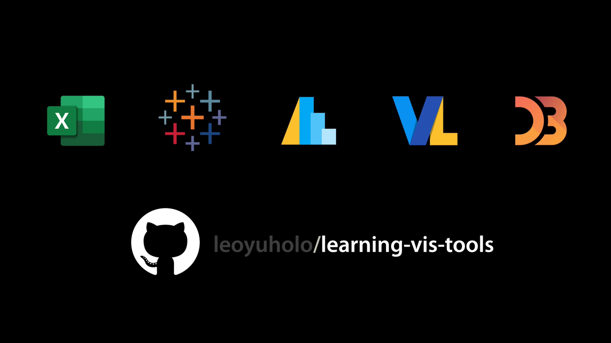

# Learning Vis Tools

Welcome to the tutorial of COMP 4462 Data Visualization! You can find the materials used in the tutorial sessions here.

While the lectures are focused on the principles of data visualization, the tutorials will focus on how to use the tools built by data visualization practitioners.

Besides these materials, you can find the course materials on [Canvas](https://canvas.ust.hk/courses/29837).

## Directory

| # | Topic | Materials | Link to Tools |
| - | - | - | - |
| 1 | [Introduction to visualization tools and warm-up with MS Excel visualization](./tutorial01) | [Slides](https://bit.ly/vis-t01) ||
| 2 | [Visualization with Tableau and data processing](./tutorial02) | [Slides](https://bit.ly/vis-t02) | Download and install Tableau: [Student](https://www.tableau.com/academic/students) (Full version, require student verification) [Public](https://public.tableau.com/en-us/s/) (Free version with limitations) |
| 3 | [Where to find visualizations and interesting datasets?](./tutorial03) | [Slides](https://bit.ly/vis-t03) ||
| 4 | [Data scientist toolbox 1: Python, Jupyter Notebook and Pandas](./tutorial04) | [Jupyter Notebook](https://bit.ly/vis-t04-nb) [Slides](https://bit.ly/vis-t04) | [Google Colab](https://colab.research.google.com/) |
| 5 | [Data scientist toolbox 2: Pandas and Python visualization](./tutorial05) | [Jupyter Notebook](https://bit.ly/vis-t05-nb) [Slides](https://bit.ly/vis-t05) ||
| 6 | [Visualization with Javascript 1: Javascript basics and Observable](./tutorial06) | [Observable Notebook](https://bit.ly/vis-t06-ob) [Slides](https://bit.ly/vis-t06) | [Observable](https://beta.observablehq.com/) |
| 7 | [Visualization with Javascript 2: Vega-Lite and data processing libraries](./tutorial07) | [Observable Notebook](https://bit.ly/vis-t07-ob) [Slides](https://bit.ly/vis-t07) ||
| 8 | [Visualization with Javascript 3: Visualization with D3.js](./tutorial08) | [Observable Notebook](https://bit.ly/vis-t08-ob) [Slides](https://bit.ly/vis-t08) ||
| 9 | [Visualization with Javascript 4: Visualization and interaction with D3.js](./tutorial09) | [Observable Notebook](https://bit.ly/vis-t09-ob) [Slides](https://bit.ly/vis-t09) ||

## References

### Excel
- [Coursera: Data Visualization with Advanced Excel (PwC)](https://www.coursera.org/learn/advanced-excel)

### Tableau
- [Coursera: Data Visualization with Tableau (Duke University)](https://www.coursera.org/learn/analytics-tableau)
- [Tableau Training Videos](https://www.tableau.com/learn/training)

### Pandas
- [Python for Data Analysis: Data Wrangling with Pandas, NumPy, and IPython (Wes McKinney)](https://www.amazon.com/dp/1449319793)
  - [GitHub of materials and Jupyter notebooks](https://github.com/wesm/pydata-book)

### Altair
- [Altair user guide](https://altair-viz.github.io/user_guide/data.html)

### Vega-Lite
- [Vega-Lite Examples](https://vega.github.io/vega-lite/examples/)
- [Vega on Observable](https://observablehq.com/@vega)

### D3.js
- [Interactive Data Visualization for the Web: An Introduction to Designing with D3 (Scott Murray)](https://alignedleft.com/work/d3-book-2e)
  - [GitHub of materials and code examples](https://github.com/alignedleft/d3-book)

And a lot of amazing [visualization examples and datasets](./tutorial03)!

## Credits
These materials are created by [Leo Yu Ho Lo](https://leoyuholo.com), [Yao Ming](http://www.myaooo.com) and [Li Wenchao](http://www.cse.ust.hk/~wlibs).

And thanks to [Prof. Huamin Qu](http://huamin.org) teaching this amazing course!
